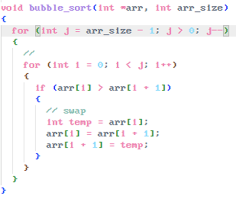

# Bubblesort: Sortieren durch vertauschen bis zum Ende

(Äußere Loop) Wir starten beim letzten Element im Array und lassen die loop laufen bis zum ersten Element (j > 0) [ j-- => um immer weiter nach vorne zu gehen ]
o Die Loop läuft also genau bis arr_size – 1
= > Loop verkleinert den Bereich in dem noch sortiert werden muss
o Das größte verbleibende Element ist nach jedem vollständigen Durchlauf dann an der richtigen Stelle.

Eine zweite Loop (Innere Loop) läuft dann vom Anfang des Arrays bis zu j, bis sich die beiden Zahlen also treffen
= > In dieser Loop vertauschen wir dann die Elemente und lassen sie nach unten „bubbeln“. Wir gucken also, ob die Zahl an arr[i] größer ist als arr[i+1].
o Wenn die Zahl bei arr[i] also größer ist, dann tauschen wir die Zahlen und gehen weiter bis i < j.

