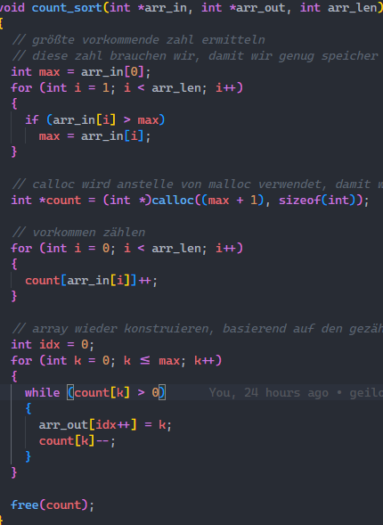

# Countsort (Nicht vergleichend)

#### Best-Case: O(m+n)

#### Worst-Case: O(m+n)

#### Average-Case: O(m+n)

#### Stabil: -

Count Sort zählt die vorkommen aller Zahlen und sortiert diese dann von klein nach groß.

Wir suchen nach der größten Zahl, da wir diese Zahl brauchen um den Speicher für den int[] zum Zählen der Zahlen zu allokieren.

Daraufhin ordnen wir die Zahlen dem int[] zu und machen dann einen einfachen Vergleich und sortieren von klein zu groß.

