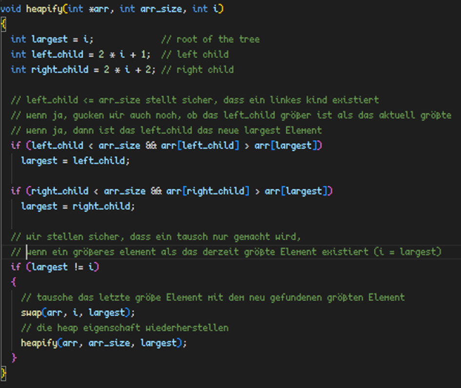

# Heapsort: (Divide and Conquer)

- Wird als vollständiger Binärbaum präsentiert
- Build_max_heap stellt sicher, dass der Binärbaum richtig präsentiert ist (linke Hälfte: 2*i+1 / rechte Hälfte: 2*i+2)
  o Für die Erstellung verwendet wir i = arr_size / 2 - 1; i >= 0; i--
- Bei einem Max-Heap ist immer das größte Element das Parent Element (idx = 0) des Arrays
- Heapify stellt sicher, dass das größte Element das Parent Element ist
  o Linkes und Rechtes letztes Element vergleiche mit dem derzeitigen Parent
- Wir tauschen das Parent Element mit dem letzten Element (nächst größtem Element im Array)
- Daraufhin verringern wir die Größe des Arrays um 1, sodass das letzte Parent Element als sortiert gilt. (Befindet sich nun ganz hinten im Array)
- Wir rufen Heapify auf, um die Heap Eigenschaft wiederherzustellen
- Dies tun wir, bis nur noch ein Element übrig ist / der Array sortiert ist.
  
  
  
