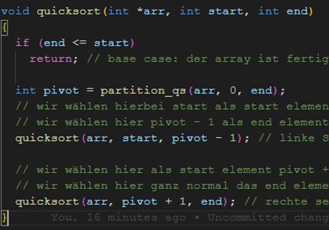
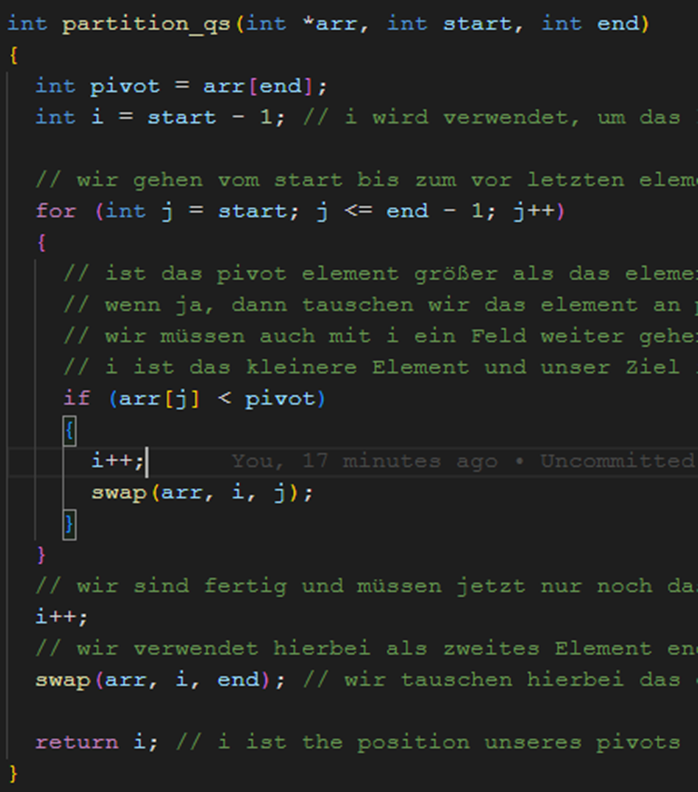

# Quicksort: (Divide and Conquer)

#### Best-Case: O(n log n)

#### Worst-Case: O(n^2)

#### Average-Case: O(n log n)

#### Stabil: Ja (kann abhängig vom gewählten Pivot sein)

- Wir teilen den Array in immer kleiner werdene Teile auf und fügen ihn dann sortiert langsam wieder zusammen
  o Dies erzielen wir, durch Partitioning.
- Partitioning: Wir wählen einen Pivot (z.B. das letzte Element des Arrays) und müssen sicherstellen, dass die Elemente links von diesem Element kleiner und rechte größer sind.
  o Dies erzielen wir, indem wir mit der Variable j vom Anfang bis zum Ende gehen und mit der Variable i immer das kleinste Element tracken (start - 1)
  o Falls dann das Pivot größer ist als das Element an arr[j], dann gehen wir eins weiter mit i und tauschen dann das Element bei arr -> i mit arr -> j
  o Nach der for loop inkrementieren wir i und setzen dann noch das das Pivot Element ans Ende und returnen i => unser neuer Pivot punkt
- In der Quicksort funktion überprüfen wir ob unser end Punkt nicht größer oder gleich dem Start ist, da dies unser Base Case ist und das heißt, dass wir fertig mit sortieren sind
  o Wir rufen dann die Partition Funktion auf, um den Pivot zu bestimmen, von start bis zum end
  o Dann überprüfen wir die zwei Hälften (linke und rechte), indem wir einmal von start bis pivot – 1 (links) und von pivot + 1 bis Ende (rechts) gehen.
  
  
