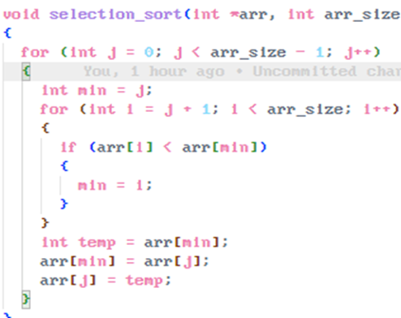

# Selectionsort: Sortieren durch auswählen des nächsten Elements

#### Best-Case: O(n^2)

#### Worst-Case: O(n^2)

#### Average-Case: O(n^2)

#### Stabil: Nein

- (Äußere Loop) Wir gehen vom Anfang des Arrays bis zum vorletzten Element (arr_size – 1)
  o j bestimmt die Position des aktuell kleinsten Elements: Bei jedem Durchlauf speichern wir den derzeitigen Index „j“ in ein der Variable int min;
- (Innere Loop) Hierbei durchsuchen wir den restlichen Teil des Arrays (Also das nächste Element immer [int i = j+1])
  Wir gucken, ob die Zahl bei arr[i], was ja die Zahl bei j+1 ist, kleiner ist als die Zahl bei arr[min] (was ja j ist) ist.
- Wenn ja: Dann ist die neue kleinste Zahl arr[i] und wir updaten int min
  Nach der inneren Loop tauschen wir die Elemente bei arr[min] und arr[j]
  
