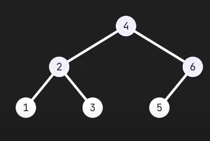

# Tree

=> Ein Tree ist eine erweiterung einer Linked List, wobei jeder Node zu mehreren Nodes zeigen kann. Mehrere Nodes können allerdings nicht auf ein Node zeigen

### Parent

- Wenn es kein Parent selber hat
- Der Eingangspunkt zum Baum selber
- Jeder Tree hat genau 1 Parent

### Child

- Wenn es ein Parent hat, also nicht der Eingangspunkt selber ist

## Beispiel

